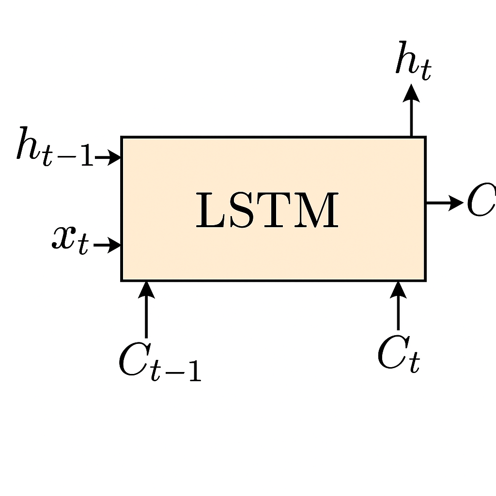

# 🧓🛡️ FallGuardAI: Fall Prediction and Prevention for the Elderly

**An AI-powered system for predicting and preventing falls in elderly people using deep learning, video surveillance, and real-time alerts.**

---

## 📌 Project Overview

FallGuardAI is an intelligent system designed to detect and predict elderly falls using LSTM neural networks and real-time video processing. It combines skeleton keypoint extraction (via MediaPipe), YOLOv8 object detection, and a Tkinter-based interface for alerts and monitoring.

---

## 🎥 Data Collection & Preprocessing

  

### 📹 Data Collection

* Videos collected from social platforms or recorded from indoor surveillance (e.g., living room, hallway, entrance).
* High-quality cameras with night vision are recommended.
* Target actions: walking, sitting, standing, falling, running, door interactions.

### 🧼 Preprocessing

* **Frame Extraction**: Split video into individual frames.
* **Skeleton Detection**: Use **MediaPipe** to extract 131 keypoints per frame.
* **Labeling**: Annotate actions such as falling, walking, fighting.
* **Time Series Creation**: Group every 60 frames into one sequence (for LSTM input).
* **Normalization & Cleaning**: Remove blurry or undetectable frames.
* **Data Augmentation**: Flip, brightness shift, translation.
* **Train-Test Split**: Random and balanced sampling by behavior class.

---

## 🧠 LSTM Model Architecture

  

1. **Input Layer**: Accepts a sequence of skeleton features.
2. **LSTM Layers**: One or more LSTM layers to capture temporal dependencies.
3. **Dropout Layers**: Reduces overfitting.
4. **Dense Layers**: Fully connected layers to output prediction.
5. **Output Layer**: Softmax for multi-class classification.

### 🔁 Training & Evaluation

  

- Train using labeled skeleton sequences.
- Monitor `accuracy` and `loss` over epochs.
- Fine-tune hyperparameters: number of neurons, layers, dropout rate, learning rate.
- Use metrics: **accuracy**, **precision**, **recall**, **F1-score**.
- Confusion matrix visualization & accuracy/loss curves.

---

## 🚪 Door Entry Detection with YOLOv8

  

* Detect humans using **YOLOv8**.
* Draw bounding boxes and measure height (top-bottom Y coordinates).
* Place two virtual lines on the door:

  * One at 10cm (bottom), one at 1m (top).
* If both lines are intersected → **Adult**.
* If only the bottom line is crossed → **Child Alert!**

---

## 🔔 Alert System & GUI

  

Built using **Tkinter**, the interface provides real-time monitoring:

* 🖼️ Live video feed with overlays
* 🔘 ON/OFF buttons to enable door tracking or fall detection
* 📱 Sends audio alert & Gmail notification upon detecting:

  * A fall action
  * A child exiting the door

---
### 📧 Gmail Alert System
- The system integrates with the **Gmail API** to send email notifications when:
  - A fall is detected
  - A child is detected exiting through a door
---

## 📊 Results Visualization

  
  

* Accuracy: Model performance over time
* Loss: Training/validation loss curve
* Confusion Matrix: Correct vs incorrect predictions
* Real-world predictions visualized with overlays

---

## 🛠️ Technologies Used

* **Python**, **TensorFlow/Keras** – Model building & training
* **OpenCV**, **MediaPipe** – Video processing & skeleton extraction
* **YOLOv8** – Object detection (Ultralytics)
* **Tkinter** – GUI development
* **Gmail API** – Send email notifications

---

## 🤝 Contributing

We welcome collaboration to:

* Improve real-time accuracy
* Expand dataset diversity
* Integrate sound & wearable sensor data
* Enhance GUI & mobile integration

---

## 📫 Contact

📧 Email: [youremail@example.com](mailto:youremail@example.com)
🌐 GitHub: [github.com/PVL-Linh](https://github.com/PVL-Linh)

---

⭐ Star this project if it inspires you or helps save lives!
